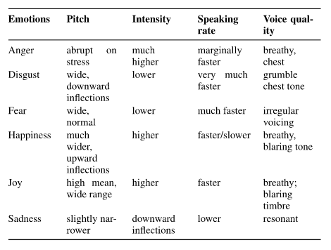
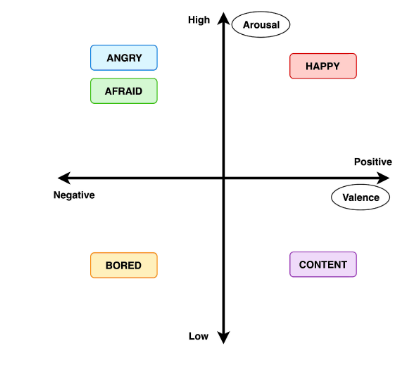
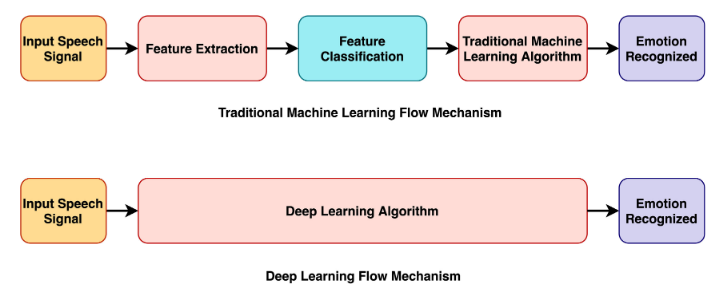
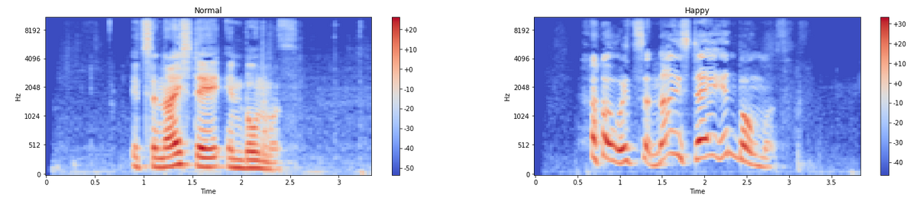
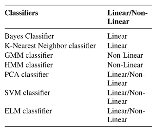
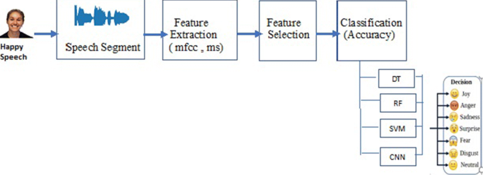
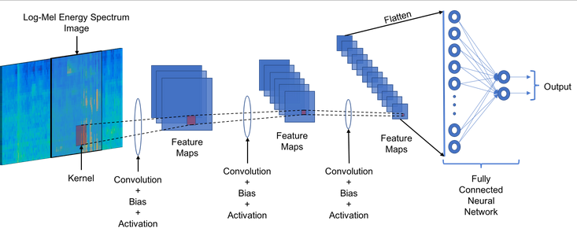

# Speech Emotion Recognition
Boyuan Cheng (ID: s5526309)

## Abstract

In recent years, it has been considered as an important research field to discover emotion content from speech signals and identify emotion from speech. Therefore, many systems, algorithms and classifiers have been developed, and many features have been mined for speech emotion recognition. Deep Learning techniques have been recently proposed as an alternative to traditional techniques in Speech Emotion Recognition. In this project, I will try to use the traditional method and the deep neural network method for speech emotion recognition, and compare their classification results.

## Detailed Description
For traditional machine learning, speech emotion recognition needs to acquire a series of sound features. Different emotions will show relatively obvious different features. We can train our classification model by matching different emotions with these features.[3] Here is a summarized form of some acoustic variations observed based on emotions. [1],[2]

 

However, nowadays, more and more people use Deep Neural Networks instead of traditional machine learning methods for speech emotion recognition due to its multi-layered structure and efficient results delivery. It is shown that deep learning algorithms perform well in emotion recognition as compared to traditional techniques. The difference between DNN and traditional methods will be shown below.

### Datasets

Made use of two different datasets:

**1. RAVDESS**
 This dataset includes around 1500 audio file input from 24 different actors. 12 male and 12 female where these actors record short audios in 8 different emotions [5]
i.e 1 = neutral, 2 = calm, 3 = happy, 4 = sad, 5 = angry, 6 = fearful, 7 = disgust, 8 = surprised.
Each audio file is named in such a way that the 7th character is consistent with the different emotions that they represent.
[Get Here](https://zenodo.org/record/1188976)

**2. SAVEE**
 This dataset contains around 500 audio files recorded by 4 different male actors. The first two characters of the file name correspond to the different emotions that the potray.
[Get Here](http://kahlan.eps.surrey.ac.uk/savee/Download.html)

### Arcitecture Proposal

#### 1. Traditional machine learning methods
**Feature extraction and selection:**
Among the features, the intensity, pitch, and variance are usually important to identify various types of emotions from the input speech signal. Here is an example. I asked one of my classmates to say "It is a nice day in Bournemouth" in two different emotions, which are normal and happiness. After the recording, I sampled the two audio signals, and processed the fast Fourier transform. Finally I got two different Mel-spectrogram images.

We can see that the frequency spectrum in normal mood is flat, while the frequency spectrum in happy mood fluctuates greatly. Therefore, emotions sometimes have relatively clear relationships with acoustic parameters. 

**Classification of features:**
There are many kinds of classifiers used for speech emotion recognition. The following table lists some common classification models. I will also select a classification model below and apply it to the traditional method of this project. [6]

 

#### 2. Deep Neural Network methods
Deep learning doesn't require us to extract features by ourselves, but to automatically learn high-dimensional abstract data through neural networks. For the problem of speech emotion recognition, I will choose Convolution Neural Network as the deep learning model. Convolutional Neural Network has the ability of representation learning, and there is no additional feature engineering requirement for data. The figure below provides the layer-wise architecture of a basic CNN network. [4]

Every input object need to be convolved, pooled and activated many times, and finally the input layer of fully connected layer is formed. After that, we use the fully connected neural network to classify it, and the probability value of the final output determines the classification of the input object.
## References
[1] Y. Zhou, Y. Sun, J. Zhang, and Y. Yan, ‘‘Speech emotion recognition using both spectral and prosodic features,’’ in Proc. IEEE Int. Conf. Inf. Eng. Comput. Sci. (ICIECS), Dec. 2009, pp. 1–4.

[2] S. Haq, P. J. Jackson, and J. Edge, ‘‘Audio-visual feature selection and reduction for emotion classification,’’ in Proc. Int. Conf. Auditory-Visual Speech Process. (AVSP), Tangalooma, QLD, Australia, 2008.

[3] T. Vogt and E. André, ‘‘Comparing feature sets for acted and spontaneous speech in view of automatic emotion recognition,’’ in Proc. IEEE Int. Conf. Multimedia Expo (ICME), Jul. 2005, pp. 474–477.

[4] A. Sehgal and N. Kehtarnavaz, "A Convolutional Neural Network Smartphone App for Real-Time Voice Activity Detection," in IEEE Access, vol. 6, pp. 9017-9026, 2018, doi: 10.1109/ACCESS.2018.2800728.

[5] Livingstone SR, Russo FA (2018) The Ryerson Audio-Visual Database of Emotional Speech and Song (RAVDESS): A dynamic, multimodal set of facial and vocal expressions in North American English. PLoS ONE 13(5): e0196391. 

[6] Khalil, Ruhul Amin et al. “Speech Emotion Recognition Using Deep Learning Techniques: A Review.” IEEE Access 7 (2019): 117327-117345.
